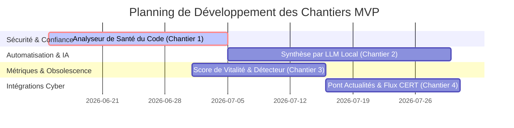

# 🗺️ Feuille de Route Technique : Différenciateurs Stratégiques (MVP Cyber Scanner) 🚀

Ce document définit les **4 chantiers technologiques majeurs** pour transformer le scanner sémantique en une plateforme de veille cyber unique, sécurisée et intelligente.

---

## 🏗️ Synthèse de la Roadmap



---

## 🛡️ Chantier 1 : L'Analyseur de "Santé et Sécurité" du Code (Le Filtre de Confiance)

> [!WARNING]
> **Risque Cyber :** Un grand nombre d'outils offensifs ou utilitaires sur GitHub sont piégés (backdoors, chevaux de Troie, infostealers). 
> **Objectif :** Valider automatiquement la propreté du code source des outils référencés avant de les proposer.

### 🛠️ Spécifications Techniques pour le Développeur
* **Intégration d'un moteur SAST :** Ajouter des outils d'analyse statique de code légers et open-source dans le conteneur Python du scanner :
  * **Bandit** (pour analyser les scripts Python à la recherche de vulnérabilités ou de comportements suspects).
  * **Semgrep** (pour exécuter des règles personnalisées détectant les connexions réseau suspectes, l'obfuscation de code ou les clés d'API codées en dur).
* **Workflow d'analyse :**
  1. Lorsqu'un outil est identifié, télécharger uniquement les fichiers critiques (scripts principaux, `main.py`, `install.sh`, etc.) en mémoire ou dans un conteneur éphémère.
  2. Lancer l'analyse SAST sur ces fichiers.
  3. Si un indicateur de danger (critique) est levé, marquer le dépôt comme `"Non certifié / Suspect"` ou l'exclure automatiquement du dashboard public.
* **Valeur PRO :** Offrir un catalogue certifié "sain" est un argument de vente majeur pour les entreprises et consultants (limitation des risques de compromission de la machine de test).

---

## 🧠 Chantier 2 : Le Générateur Automatique de Fiches de Synthèse (LLM Local)

> [!NOTE]
> **Problématique :** Les professionnels n'ont pas le temps de parcourir de longues descriptions de dépôts ou des fichiers README complets.
> **Objectif :** Générer une fiche technique synthétique standardisée de 3 lignes pour chaque ressource découverte.

### 🛠️ Spécifications Techniques pour le Développeur
* **Modèle d'IA Local :** Déployer **Ollama** (contenant des modèles légers comme `Mistral-7B` ou `Llama-3-8B`) via un conteneur Docker séparé dans la même pile `docker-compose`.
* **Génération structurée :** Rédiger un prompt système rigoureux forçant le modèle à renvoyer un format JSON strict contenant les champs suivants :
  * `objectif` : Description claire et vulgarisée de l'utilité du projet (1 phrase).
  * `prerequis` : Langages, dépendances ou OS requis (ex: Python 3, Linux, Docker).
  * `commande_flash` : La commande de démarrage rapide (ex: `docker run ...` ou `pip install ...`).
* **Optimisation :** Mettre en cache ces fiches dans PostgreSQL pour éviter les calculs redondants.

---

## 📊 Chantier 3 : Le Détecteur de Tendances et de "Morts" (Score de Vitalité)

> [!TIP]
> **Problématique :** Les listes statiques sur le web (types "Awesome") contiennent 80 % de projets morts ou non fonctionnels.
> **Objectif :** Mesurer dynamiquement la santé opérationnelle de chaque dépôt via les métadonnées de l'API GitHub.

### 🛠️ Spécifications Techniques pour le Développeur
* **Formule du Score de Vitalité :** Calculer un indicateur de maintien de code (de 0 à 100) basé sur les facteurs suivants :
  $$\text{Score Vitalité} = f(\text{Dernier Commit}, \text{Ratio Issues Ouvertes / Résolues}, \text{Fréquence des Pull Requests})$$
  * **Pénalité d'inactivité :** Si aucun commit n'a été effectué depuis > 18 mois, appliquer un malus immédiat de -50 points.
  * **Alerte Tendance (Trending) :** Si la croissance des étoiles dépasse un certain seuil hebdomadaire (ex: +200 stars en 3 jours), appliquer un badge `"Tendance Chaude"`.
* **Affichage dynamique :** Proposer un filtre sur le Dashboard permettant de masquer instantanément les outils "morts" ou "non maintenus".

---

## 📰 Chantier 4 : L'Interconnexion avec l'Actualité (Le Pont Cyber)

> [!IMPORTANT]
> **Problématique :** La recherche d'outils et de ressources par les ingénieurs cyber est directement dictée par les actualités et les vagues d'attaques du moment.
> **Objectif :** Connecter l'application à l'actualité des menaces en temps réel pour suggérer dynamiquement les ressources associées.

* **Recommandation Dynamique :** Si une alerte critique concerne par exemple "Windows Exchange" ou "Log4j", pousser instantanément en tête de la page d'accueil (bannière d'alerte) les outils, checklists de durcissement et documentations liés à ces mots-clés déjà présents dans notre base de données.

---

## ⚡ Migration Majeure : Ingestion Massive & Moteur Vectoriel Dédié (v1.4.0)

Pour propulser la vitesse d'indexation bien au-delà de 10 000 dépôts et sécuriser les outils référencés, la stack technique doit évoluer d'une simple base relationnelle vers une architecture distribuée multi-moteurs intégrant une base de données vectorielle dédiée et des outils de sécurité industrielle.

### 1. Remplacement de pgvector par Qdrant (Base Vectorielle Dédiée)
Bien que PostgreSQL soit performant, la comparaison de milliers d'embeddings sémantiques ralentit les requêtes de recherche complexes.
* **Le saut technologique :** Intégrer **Qdrant** (ou Milvus), une base de données vectorielle spécialisée utilisant des index de type **HNSW** (Hierarchical Navigable Small World).
* **Le gain :** Recherche sémantique sous les 2 millisecondes pour 10 000+ ressources, avec une consommation de mémoire RAM 5 fois moindre.

### 2. Traitement NLP & Vectoriel par Lots (Batch Processing)
Pour supprimer le goulot d'étranglement de l'analyse unitaire, le développeur doit traiter les descriptions par vagues de 64 ou 128 éléments.

```python
# À intégrer dans src/nlp_processor.py pour remplacer l'analyse unitaire
def process_repositories_in_batches(self, list_of_repos, batch_size=128):
    """Analyse et génère les vecteurs sémantiques par vagues (Batches)
    pour multiplier la vitesse d'indexation par 10.
    """
    cleaned_results = []

    for i in range(0, len(list_of_repos), batch_size):
        batch = list_of_repos[i : i + batch_size]

        # 1. Extraction des descriptions du lot
        descriptions = [repo.get("description", "") for repo in batch]

        # 2. Génération vectorielle DE MASSE (Ultra rapide sur CPU/GPU)
        # L'argument batch_size ici est natif au modèle de Deep Learning
        vectors = encoder.encode(
            descriptions, batch_size=batch_size, show_progress_bar=False
        ).tolist()

        # 3. Association des résultats et scoring
        for index, repo in enumerate(batch):
            desc = descriptions[index]
            keywords = self.extract_key_phrases(desc)  # Extraction rapide
            quality_score = self.calculate_relevance_score(repo, keywords)

            cleaned_results.append(
                {
                    "id": repo.get("id"),
                    "nom": repo.get("Nom du Dépôt"),
                    "vecteur": vectors[index],  # Le vecteur généré en lot
                    "mots_cles": keywords,
                    "score": quality_score,
                }
            )

    return cleaned_results
```

### 3. Pipeline Asynchrone Parallélisé (Task Queues)
Le téléchargement asynchrone des dépôts GitHub et le traitement NLP/calcul d'embeddings par l'IA doivent s'exécuter en parallèle via une architecture de producteurs-consommateurs.
* **Le concept :** Le démon asynchrone télécharge les métadonnées et alimente immédiatement une file d'attente (`Multiprocessing.Queue`).
* **Le worker :** Un processus worker dédié pioche dans la file pour calculer les embeddings par lots et les injecter dans la base vectorielle sans bloquer les téléchargements.

### 4. Intégration d'Outils SAST Professionnels via Docker-in-Docker
Pour offrir un catalogue certifié sain, le moteur doit auditer le code des outils indexés à l'aide des meilleurs scanners open-source de l'industrie :

1. **Trivy (AquaSecurity)** : Détection des vulnérabilités de dépendances (`requirements.txt`, `package.json`), scan des configurations et fuites de secrets.
   * *Commande Docker* : `docker run --rm -v /chemin/du/repo:/apps aquasec/trivy fs /apps --format json`
2. **Semgrep (SAST)** : Analyse du code sans exécution à la recherche de failles logiques (injections SQL, mauvaises pratiques).
   * *Commande Docker* : `docker run --rm -v /chemin/du/repo:/src returntocorp/semgrep semgrep --config=auto --json`
3. **Gitleaks** : Chasse aux clés privées, jetons d'API ou mots de passe stockés dans l'historique des commits.
   * *Commande Docker* : `docker run --rm -v /chemin/du/repo:/path zricethezav/gitleaks:latest detect --source=/path --report-format=json`

> [!IMPORTANT]
> **Configuration Docker-in-Docker (Socket Sharing) :**
> Pour permettre au script Python d'exécuter ces scanners de manière isolée et éphémère sans alourdir le conteneur du scanner, il suffit d'exposer le socket Docker de la machine hôte au conteneur du scanner :
> `- /var/run/docker.sock:/var/run/docker.sock` dans les volumes du service `cyber-scanner`.

---

## 🐳 Architecture Docker Compose Multi-Moteurs (Production)

Voici le fichier `docker-compose.yml` optimisé à donner à votre développeur pour le déploiement de cette infrastructure haute performance :

```yaml
version: '3.8'

services:
  # Base Relationnelle alpine (Pour stocker les métadonnées : noms, liens, dates)
  cyber-db:
    image: postgres:15-alpine
    container_name: cyber_meta_db
    restart: always
    environment:
      POSTGRES_DB: scanner_db
      POSTGRES_USER: postgres
      POSTGRES_PASSWORD: cyberpass
    volumes:
      - postgres_data:/var/lib/postgresql/data

  # SUPER MOTEUR SÉMANTIQUE (Pour la recherche vectorielle instantanée)
  cyber-vector-engine:
    image: qdrant/qdrant:latest
    container_name: cyber_qdrant_engine
    restart: always
    ports:
      - "6333:6333" # API REST de Qdrant
      - "6334:6334" # API gRPC
    volumes:
      - qdrant_data:/qdrant/storage

  # Le Scanner optimisé en Pipeline Batch
  cyber-scanner:
    build: .
    container_name: cyber_github_scanner
    restart: always
    depends_on:
      - cyber-db
      - cyber-vector-engine
    volumes:
      - /var/run/docker.sock:/var/run/docker.sock # Partage du socket Docker pour le SAST
      - ./data:/app/data

volumes:
  postgres_data:
  qdrant_data:
```

