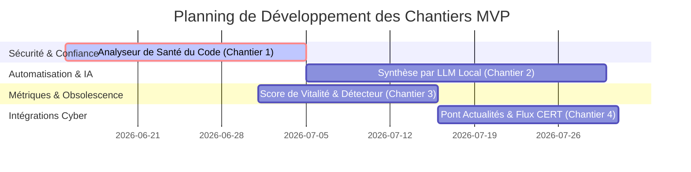

# 🗺️ Feuille de Route Technique : Différenciateurs Stratégiques (MVP Cyber Scanner) 🚀

Ce document définit les **4 chantiers technologiques majeurs** pour transformer le scanner sémantique en une plateforme de veille cyber unique, sécurisée et intelligente.

---

## 🏗️ Synthèse de la Roadmap

---

## 🛡️ Chantier 1 : L'Analyseur de "Santé et Sécurité" du Code (Le Filtre de Confiance)

> [!WARNING]
> **Risque Cyber :** Un grand nombre d'outils offensifs ou utilitaires sur GitHub sont piégés (backdoors, chevaux de Troie, infostealers). 
> **Objectif :** Valider automatiquement la propreté du code source des outils référencés avant de les proposer.

### 🛠️ Spécifications Techniques pour le Développeur
* **Intégration d'un moteur SAST :** Ajouter des outils d'analyse statique de code légers et open-source dans le conteneur Python du scanner :
  * **Bandit** (pour analyser les scripts Python à la recherche de vulnérabilités ou de comportements suspects).
  * **Semgrep** (pour exécuter des règles personnalisées détectant les connexions réseau suspectes, l'obfuscation de code ou les clés d'API codées en dur).
* **Workflow d'analyse :**
  1. Lorsqu'un outil est identifié, télécharger uniquement les fichiers critiques (scripts principaux, `main.py`, `install.sh`, etc.) en mémoire ou dans un conteneur éphémère.
  2. Lancer l'analyse SAST sur ces fichiers.
  3. Si un indicateur de danger (critique) est levé, marquer le dépôt comme `"Non certifié / Suspect"` ou l'exclure automatiquement du dashboard public.
* **Valeur PRO :** Offrir un catalogue certifié "sain" est un argument de vente majeur pour les entreprises et consultants (limitation des risques de compromission de la machine de test).

---

## 🧠 Chantier 2 : Le Générateur Automatique de Fiches de Synthèse (LLM Local)

> [!NOTE]
> **Problématique :** Les professionnels n'ont pas le temps de parcourir de longues descriptions de dépôts ou des fichiers README complets.
> **Objectif :** Générer une fiche technique synthétique standardisée de 3 lignes pour chaque ressource découverte.

### 🛠️ Spécifications Techniques pour le Développeur
* **Modèle d'IA Local :** Déployer **Ollama** (contenant des modèles légers comme `Mistral-7B` ou `Llama-3-8B`) via un conteneur Docker séparé dans la même pile `docker-compose`.
* **Génération structurée :** Rédiger un prompt système rigoureux forçant le modèle à renvoyer un format JSON strict contenant les champs suivants :
  * `objectif` : Description claire et vulgarisée de l'utilité du projet (1 phrase).
  * `prerequis` : Langages, dépendances ou OS requis (ex: Python 3, Linux, Docker).
  * `commande_flash` : La commande de démarrage rapide (ex: `docker run ...` ou `pip install ...`).
* **Optimisation :** Mettre en cache ces fiches dans PostgreSQL pour éviter les calculs redondants.

---

## 📊 Chantier 3 : Le Détecteur de Tendances et de "Morts" (Score de Vitalité)

> [!TIP]
> **Problématique :** Les listes statiques sur le web (types "Awesome") contiennent 80 % de projets morts ou non fonctionnels.
> **Objectif :** Mesurer dynamiquement la santé opérationnelle de chaque dépôt via les métadonnées de l'API GitHub.

### 🛠️ Spécifications Techniques pour le Développeur
* **Formule du Score de Vitalité :** Calculer un indicateur de maintien de code (de 0 à 100) basé sur les facteurs suivants :
  $$\text{Score Vitalité} = f(\text{Dernier Commit}, \text{Ratio Issues Ouvertes / Résolues}, \text{Fréquence des Pull Requests})$$
  * **Pénalité d'inactivité :** Si aucun commit n'a été effectué depuis > 18 mois, appliquer un malus immédiat de -50 points.
  * **Alerte Tendance (Trending) :** Si la croissance des étoiles dépasse un certain seuil hebdomadaire (ex: +200 stars en 3 jours), appliquer un badge `"Tendance Chaude"`.
* **Affichage dynamique :** Proposer un filtre sur le Dashboard permettant de masquer instantanément les outils "morts" ou "non maintenus".

---

## 📰 Chantier 4 : L'Interconnexion avec l'Actualité (Le Pont Cyber)

> [!IMPORTANT]
> **Problématique :** La recherche d'outils et de ressources par les ingénieurs cyber est directement dictée par les actualités et les vagues d'attaques du moment.
> **Objectif :** Connecter l'application à l'actualité des menaces en temps réel pour suggérer dynamiquement les ressources associées.

### 🛠️ Spécifications Techniques pour le Développeur
* **Agrégateur de Menaces :** Développer un démon d'arrière-plan interrogeant périodiquement les flux d'actualités et d'alertes officiels (flux RSS du **CERT-FR / ANSSI**, **The Hacker News**, **Bleeping Computer**).
* **Extraction de Mots-Clés (NLP) :** Passer les titres des alertes d'actualité dans l'analyseur Spacy de notre scanner pour en extraire les entités nommées (noms de logiciels, vulnérabilités CVE, groupes d'attaquants).
* **Recommandation Dynamique :** Si une alerte critique concerne par exemple "Windows Exchange" ou "Log4j", pousser instantanément en tête de la page d'accueil (bannière d'alerte) les outils, checklists de durcissement et documentations liés à ces mots-clés déjà présents dans notre base de données PostgreSQL.
